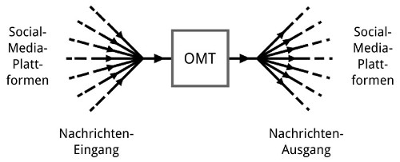

# OMT
An Online Management Tool for Social Media
---

*... work in progress ...*

This web application is part of a scientific work for the [Stuttgart Media University](https://www.hdm-stuttgart.de/english).

## Abstract

The wide range of social media channels makes it challenging to fully utilize their benefits. 
On this account, an online management tool for social media is developed, which
allows the simultaneous control of different social media platforms, thus facilitate administration. 
The development process is built upon a use case based requirements analysis. 
Due to the realization of the web application, it is determined that use cases do have
a positive impact on development. The result is the presentation of a functional prototype,
which demonstrates that the idea is technically feasible.

